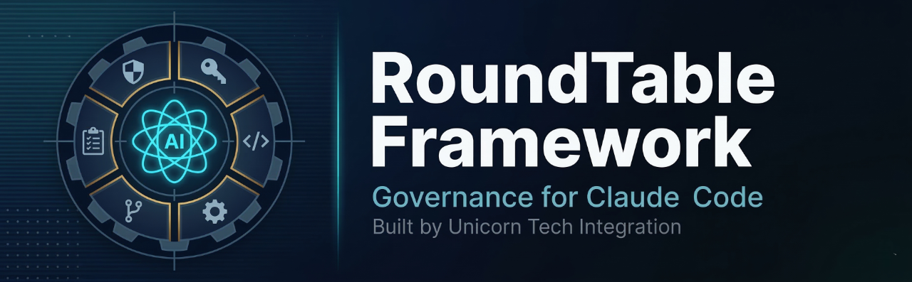
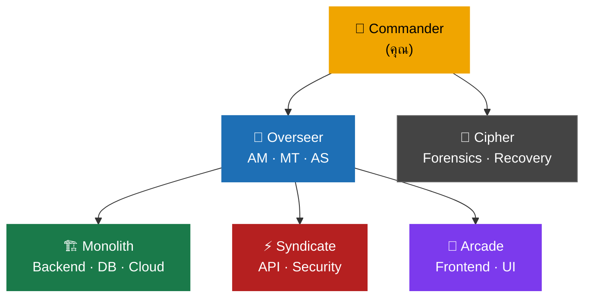

<p align="center">
  
</p>

<p align="center">
  <a href="https://github.com/VarakornUnicornTech/roundtable-framework/releases"></a>
  
  
  
  
  
  
</p>

<p align="center">
  <strong>English:</strong> <a href="README.md">Read README in English</a>
</p>

---

> [!NOTE]
> **ระบบบริหารจัดการทีม AI สำหรับ Claude Code — ship ด้วยความมั่นใจ ไม่ใช่แค่ความเร็ว**
> เปลี่ยน Claude Code ให้กลายเป็นองค์กรวิศวกรรมที่ทำงานประสานกัน ด้วยทีมเฉพาะทาง approval gate นโยบายที่บังคับใช้อัตโนมัติ และ audit trail ครบถ้วน

**โดย [Unicorn Tech Integration Co., Ltd.](https://www.unicorntechint.com)**

---

## สารบัญ

- [ทำไมต้อง RoundTable?](#ทำไมต้อง-roundtable)
- [เริ่มต้นใช้งาน](#เริ่มต้นใช้งาน)
- [3 ระดับการใช้งาน](#3-ระดับการใช้งาน)
- [ทีม](#ทีม)
- [Skills](#skills)
- [Rules & Hooks](#rules-path-scoped)
- [โครงสร้างโปรเจค](#โครงสร้างโปรเจค)
- [นโยบาย](#นโยบาย)
- [การปรับแต่ง](#การปรับแต่ง)
- [ความต้องการของระบบ](#ความต้องการของระบบ)

---

## ทำไมต้อง RoundTable?

<table>
<tr>
  <td align="center" width="20%">🏗️<br><b>5 ทีม</b><br><sub>16 personas เฉพาะทาง</sub></td>
  <td align="center" width="20%">📋<br><b>Phase Gates</b><br><sub>ขั้นตอนผ่าน ticket</sub></td>
  <td align="center" width="20%">🔍<br><b>Audit Trail ครบถ้วน</b><br><sub>บันทึกทุกการตัดสินใจ</sub></td>
  <td align="center" width="20%">⚡<br><b>21 Skills</b><br><sub>Slash command พร้อมใช้</sub></td>
  <td align="center" width="20%">🛡️<br><b>Policy Engine</b><br><sub>มาตรฐาน 9 ข้อ</sub></td>
</tr>
</table>

| | Claude Code ทั่วไป | **RoundTable** |
|---|---|---|
| **โครงสร้าง** | Assistant คนเดียว | 5 ทีม + 16 personas |
| **การวางแผน** | ไม่มีระบบ | Phase dispatch + ticket gates |
| **Code Review** | ตรวจเอง | 2-pass + cross-layer trace |
| **การ Ship** | git manual | `/git pr` พร้อม rebase + governance gates |
| **QA** | ตรวจเอง | Playwright MCP + smoke test gates |
| **Retrospective** | ไม่มี | `/git lookback` — git + session data + decision audit |
| **Governance** | ไม่มี | ลำดับชั้นครบ + approval gates |
| **Audit Trail** | ไม่มี | บันทึกและตรวจสอบได้ทุกการตัดสินใจ |
| **Multi-Team** | ไม่ได้ | 4 ทีม + parallel execution |
| **ติดตั้ง** | N/A | ~30 วินาที |

---

## เริ่มต้นใช้งาน

### ติดตั้งผ่าน Claude Code (แนะนำ)

คัดลอก prompt ด้านล่างแล้ววางลงใน Claude Code:

**ภาษาไทย:**
```
ติดตั้ง RoundTable Framework จาก https://github.com/VarakornUnicornTech/roundtable-framework ลงใน project ปัจจุบัน ตาม Getting Started ที่ https://github.com/VarakornUnicornTech/roundtable-framework/wiki/Getting-Started
```

**English:**
```
Install the RoundTable Framework from https://github.com/VarakornUnicornTech/roundtable-framework into my current project. Follow the Getting Started guide at https://github.com/VarakornUnicornTech/roundtable-framework/wiki/Getting-Started
```

> [!TIP]
> ใช้คำว่า **"ติดตั้ง"** หรือ **"install"** — ไม่ใช่ "อ่าน", "อธิบาย" หรือ "ศึกษา rules"
> การพูดถึง ".claude rules" ทำให้ Claude อ่านไฟล์ policy ทุกไฟล์ก่อนเริ่มติดตั้ง — ช้ากว่ามาก

### ติดตั้งด้วยตัวเอง (Manual Install)

**Bash / Git Bash / macOS / Linux:**
```bash
git clone https://github.com/VarakornUnicornTech/roundtable-framework.git .claude-template
cp -r .claude-template/.claude/ your-project/.claude/
cp .claude-template/plugin.json your-project/plugin.json
cp .claude-template/.mcp.json your-project/.mcp.json
cp -r .claude-template/hooks/ your-project/hooks/
rm -rf .claude-template
```

**PowerShell (Windows):**
```powershell
git clone https://github.com/VarakornUnicornTech/roundtable-framework.git .claude-template
Copy-Item -Recurse .claude-template\.claude\ your-project\.claude\
Copy-Item .claude-template\plugin.json your-project\plugin.json
Copy-Item .claude-template\.mcp.json your-project\.mcp.json
Copy-Item -Recurse .claude-template\hooks\ your-project\hooks\
Remove-Item -Recurse -Force .claude-template
```

จากนั้นแก้ไข `.claude/ProjectEnvironment.md` ด้วยรายละเอียดโปรเจคของคุณ แล้วเปิด Claude Code

---

## 3 ระดับการใช้งาน

> [!TIP]
> แต่ละระดับเป็น opt-in ทั้งหมด เริ่มจาก Level 1 แล้วขยายตามความต้องการ

### Level 1 — "แค่อยากให้ ship ได้ดีขึ้น"
ใช้ `/git commit` และ `/git pr` ไม่มี governance overhead — แค่ ship ได้ดีขึ้น

### Level 2 — "อยากมีโครงสร้างโปรเจค"
ใช้ `/team-start`, `/phase-status`, `/bug-report` พัฒนาแบบ phase-based โดยไม่ต้องจำลองทีมเต็มรูปแบบ

### Level 3 — "อยากได้ governance เต็มรูปแบบ"
เปิด hooks ทั้งหมด ใช้ agent teams บันทึกครบถ้วน ระดับ enterprise

---

## ทีม



| ทีม | ขอบเขต | สไตล์ |
|-----|--------|-------|
| **Overseer** | บริหารโปรเจค, ตัดสินใจด้านสถาปัตยกรรม | สมดุล, รอบคอบ, ปฏิบัติตามมาตรฐาน |
| **Monolith** | Backend หลัก, Infrastructure, DB schema, Cloud, เอกสาร | Verbose, type-safe, bulletproof |
| **Syndicate** | API integration, Query optimization, Security | Pragmatic, กระชับ, มุ่งประสิทธิภาพ |
| **Arcade** | Frontend UI, Gamification, ระบบสร้างสรรค์ | ชาญฉลาด, ทันสมัย, สร้างสรรค์ |
| **Cipher** | วินิจฉัยฮาร์ดแวร์, Disk forensics, กู้คืน RAID | ผ่าตัดแม่นยำ, zero-write, ตรวจสอบก่อนลงมือ |

---

## Skills

### Workflow Skills
| Command | ความสามารถ |
|---------|-----------|
| `/team-start [Team] [Project] [Phase] [free\|hold]` | เริ่มต้นทีมอย่างเป็นทางการ |
| `/phase-status [Project]` | รายงาน phase + สถานะ ticket ทั้งหมด |
| `/compact-resume` | กลับเข้า session หลัง compact |
| `/overseer-report [ID]` | บันทึก OverseerReport |

### Planning Skills
| Command | ความสามารถ |
|---------|-----------|
| `/bug-report [Project] [desc]` | สร้าง bug fix ticket + โฟลเดอร์ |
| `/mod-log [Project] [name]` | สร้าง modification ticket + โฟลเดอร์ |
| `/sub-feature [Project] [name]` | สร้าง sub-feature ticket + โฟลเดอร์ |

### Quality Skills
| Command | ความสามารถ |
|---------|-----------|
| `/audit [Project] [scope?]` | Audit แบบ end-to-end — หา gap bugs |
| `/git commit [branch?]` | Governed commit — rebase, 2-pass review, ticket gate |
| `/git pr [branch?]` | Governed pull request พร้อม governance gates |
| `/git lookback [period?]` | Retrospective — git + session data + decision audit |

### Persona Skills
| Command | ความสามารถ |
|---------|-----------|
| `/Overseer` `/Monolith` `/Syndicate` `/Arcade` `/Cipher` | สลับ persona ของทีม |

### Framework Management
| Command | ความสามารถ |
|---------|-----------|
| `/template version` | ตรวจสอบเวอร์ชันที่ติดตั้ง |
| `/template check update` | เปรียบเทียบ local กับ remote ล่าสุด |
| `/template preview` | วิเคราะห์ผลกระทบก่อน upgrade |
| `/template changelog [version?]` | ดู changelog |
| `/template apply` | Upgrade พร้อม auto-backup + Smart Merge |
| `/template rollback [version?]` | คืนค่าเวอร์ชันก่อนหน้า |

---

## Rules (Path-Scoped)

ไฟล์ rule ใน `.claude/rules/` โหลดอัตโนมัติตาม context ของไฟล์:

| Rule | เมื่อโหลด | บังคับใช้ |
|------|----------|----------|
| `governance.md` | ทุกไฟล์ | Plan-before-code, no-code-before-ticket, ticket/briefing standards, phase gates |
| `logging.md` | ทุกไฟล์ | Session logging, rotation, handover, OverseerReport, TeamChat |
| `debugging.md` | Code files (`.ts`, `.js`, `.py` ฯลฯ) | Instrument-first, probe standards, cross-layer trace |
| `testing.md` | Test files (`*.test.*`, `*.spec.*`) | Unit tests, regression gates, living docs |
| `codebase-scanning.md` | ทุกไฟล์ | L1/L2/L3 tiered scan protocol, completeness checks |
| `parallel-execution.md` | ทุกไฟล์ | ZCB guarantee, ticket ownership, multi-session |
| `skills-and-subagents.md` | ทุกไฟล์ | Skill format, orchestration modes, subagent triggers |

## Hooks (Automated Enforcement)

Hooks กำหนดใน `.claude/settings.json` ภายใต้ key `"hooks"` Scripts อยู่ใน `hooks/scripts/`

| Hook | Event | ทำอะไร |
|------|-------|--------|
| `SessionStart` | เริ่ม session | ยืนยันว่า RoundTable governance framework ทำงานอยู่ |
| `check-ticket-exists` | PreToolUse (Edit/Write) | เตือนถ้าไม่มี ticket ก่อนแก้ไขโค้ด |
| `log-file-change` | PostToolUse (Edit/Write) | บันทึกการเปลี่ยนแปลงไฟล์ลง audit trail |
| Protected files | PreToolUse (Edit/Write) | Prompt hook — บล็อกการแก้ไข CLAUDE.md, policies, agents โดยไม่ได้รับอนุญาต |

> [!WARNING]
> **Windows:** Hook scripts ต้องใช้ Git Bash หรือ WSL ตรวจสอบให้แน่ใจว่า `bash` และ `jq` อยู่ใน PATH

---

## โครงสร้างโปรเจค

```
your-project/
├── .claude/
│   ├── CLAUDE.md                # นโยบายหลัก (จุดเริ่มต้น)
│   ├── ProjectEnvironment.md    # ทะเบียนโปรเจค
│   ├── settings.json            # Permissions + hooks + protected file rules
│   ├── agents/                  # นิยามทีม 5 ทีม
│   ├── rules/                   # 7 ไฟล์กฎตามเส้นทาง
│   ├── skills/                  # Slash command 21 รายการ
│   │   ├── git/                 # VCS รวม: commit, pr, lookback
│   │   ├── audit/               # Multi-domain gap bug finder
│   │   └── ...
│   ├── policies/                # ไฟล์นโยบาย 9 ฉบับ (§1–§9)
│   └── team_chat/               # บันทึกการสื่อสารระหว่างทีม + Cipher
├── hooks/                       # Hook scripts (config ใน .claude/settings.json)
│   └── scripts/                 # check-ticket-exists.sh, log-file-change.sh
├── .mcp.json                    # Playwright browser automation
├── plugin.json                  # Plugin manifest
└── RoundTable/                  # Session logs (สร้างตอน runtime)
```

---

## นโยบาย

<details>
<summary>ดูนโยบายทั้ง 9 ข้อ</summary>

| นโยบาย | ครอบคลุมเรื่อง |
|--------|--------------|
| §1 Logging & RoundTable | การบันทึก session, รูปแบบ RoundTable, นโยบายหมุนเวียนไฟล์ |
| §2 Tickets & Briefings | การ dispatch phase, briefing mail, มาตรฐาน ticket, UX smoke test |
| §3 Team Chat & Handover | โปรโตคอลข้ามทีม, OverseerReport, ไฟล์ส่งต่องาน |
| §4 Development Structure | การจัดระเบียบโปรเจค, planning-first workflow, error catalog |
| §5 Pre-Existing Codebase | Tiered Scan Protocol (L1/L2/L3), การตรวจสอบความสมบูรณ์ |
| §6 Debugging Protocol | กฎ Instrument-First, มาตรฐาน probe, สแกนผลกระทบข้างเคียง |
| §7 Parallel Execution | ZCB guarantee, ความเป็นเจ้าของ ticket, สัญญาณ dependency |
| §8 Skills & Subagents | รายการ skill, โหมดการ orchestrate, มาตรฐาน subagent |
| §9 Multi-Session | One-session-per-project, project-prefixed logging |

</details>

---

## การปรับแต่ง

<details>
<summary>ปรับแต่งสำหรับโปรเจคของคุณ</summary>

RoundTable ออกแบบมาให้ fork และปรับแต่งได้:

- **เปลี่ยนชื่อสมาชิกทีม** — แก้ไขไฟล์ agent ให้ตรงกับชื่อรหัสที่คุณต้องการ
- **เพิ่ม/ลบทีม** — สร้างไฟล์ agent ใหม่หรือลบที่ไม่ใช้
- **ปรับนโยบาย** — แก้ไขไฟล์นโยบายใน `policies/` ให้เหมาะกับโปรเจค
- **เพิ่ม skill** — สร้างไฟล์ `.claude/skills/[name]/SKILL.md` ใหม่
- **ปรับระดับ enforcement** — แก้ไขไฟล์ใน `.claude/rules/`
- **เปลี่ยนชื่อผู้มีอำนาจ** — แทนที่ "Commander" ด้วยตำแหน่งที่คุณต้องการ
- **Toggle hooks** — สลับระหว่าง warning กับ blocking mode ใน hook scripts

</details>

---

## ความต้องการของระบบ

- ติดตั้ง [Claude Code](https://docs.anthropic.com/en/docs/claude-code) CLI
- มี Claude API access (Anthropic API key)

## ผู้พัฒนา

**Unicorn Tech Integration Co., Ltd.**
- เว็บไซต์: [unicorntechint.com](https://www.unicorntechint.com)
- GitHub: [@VarakornUnicornTech](https://github.com/VarakornUnicornTech)
- สถานที่: กรุงเทพมหานคร, ประเทศไทย

## สัญญาอนุญาต

MIT License — ดูรายละเอียดที่ [LICENSE](LICENSE)

---

<p align="center">
  <br>
  <sub><b>RoundTable Framework v2.0.0</b> — สร้างโดย <a href="https://www.unicorntechint.com">Unicorn Tech Integration Co., Ltd.</a></sub><br>
  <sub>กรุงเทพมหานคร, ประเทศไทย 🇹🇭</sub>
</p>
